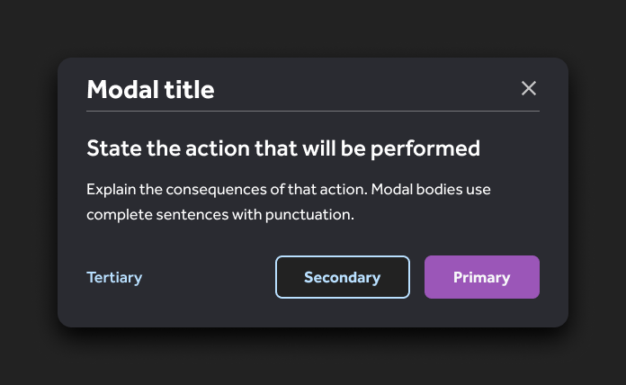

##### Jon's scratchpad:

# Header (properties version)
#### Usage tab

This is a placeholder image to see if we can use github as a way to do documentation.

This header introduces 3 main size variants (SM, M, L) with toggles for:
* Expanded/Condensed (New header item subcomponent)
* Signed in/out
* 12 total main variants

## Subcomponents
`Header/Subcomponents/`

### Left side:
* Logo (for 4 TDOC brands - Current, legacy, legacy LVGO, legacy MyStrength)
* Cobrand placeholder
* Page or site name placeholder
* Tab-item

### Right side:
*  Header-item
    -  Help
    -  Messages
    -  Profile (has condensed and expanded versions)
    -  Hamburger menu (for small & medium sizes)

## Changelog
Dramatically reduced the amount of variants in this component. Followed guidance from existing header work using auto-layout to correctly place and space subcomponents.

### Caveats
* Badge used is the propped version and this is smaller than the existing Pulse badge
* It is possible to turn on the dot version of the badge when there is only a label visible for Header-item; do not do this!
* Use the layer palette to discover additional editable elements:
    -   If you see a finger pointing, click on that layer and you should see additional formating options in the inspector palette
    -   Look for a pencil icon in the layer palette for any editable text  

### New!!
#### Subcomponents
* New Menu item subcomponent (multiple states; Editable label)
* Propped brand logo selector (includes current TDH, Legacy TD, Legacy LVGO, Legacy MYST)
* Boolean and Label editable Tab-item 
* New cobranding subcomponent
* Header-item subcomponent (propped badge; propped icon, with boolean and propped Label)
* Propped Header-profile subcomponent
    -  Avatar (propped, boolean)
    -  Icon button (propped, boolean)
    -  User Name (propped, boolean)
* Header-sign-in subcomponent (boolean)
* New Header-item (right side of header) with Boolean icon, label and badging; propped icon, propped label; disabled state
* Boolean for signed in/signed out 
 
### Quality of Life improvements
* Introduced hint icons in front of the layer name in actionable layers:
    -  A pointer icon prior to the layer name to indicate where a user can select that layer to further edit a subcomponent
    -  A pencil icon prior to the layer name for editable text layers
* New sizing:
    -  Small - 375
    -  Medium - 768
    -  Large - 1200

