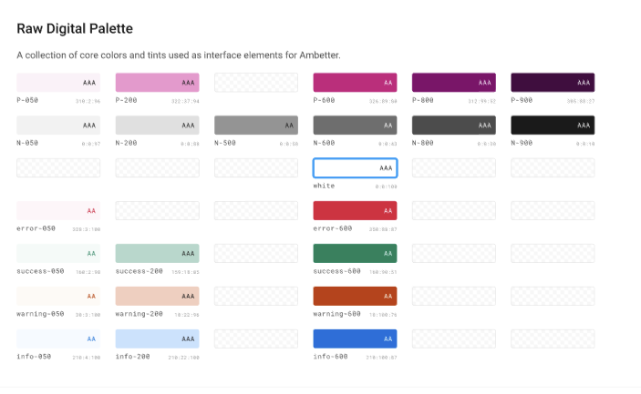

# Summary
This document is written from the perspective of someone needing to take existing design work and re-theme it with new colors and fonts.
This tutorial will reference Pulse: Components as well as Pulse: Core Styles libraries. 

## Who is this for?
Core UX members who are tasked with helping other product design team creating cobranded or client-branded styles for clients. If you are not a member of Core UX, this is still a useful tutorial, but you should work with a member of Core UX to ensure the proper process and have the necessary Figma privileges.
You will be duplicating the Pulse Core Styles library, renaming it and editing your renamed version to make any color and font changes. Then we'll show you how to swap any existing style library with the new library you have made and watch the magic as Pulse components get restyled. 
I'll be using the current design system, Pulse, to demonstrate how to leverage all the work on Pulse to take work designed using  instances of Pulse Library Components and the Pulse Style Library. For the purpose of this document, we'll focus on the style library only, not the Pulse Components.

## Assumptions 
This tutorial assumes:
You have a knowledge of how Figma structures work areas, projects and working files. If you need to understand this aspect of Figma, you can learn more here.
You have work that uses Pulse components and styles, with no custom overrides
any overrides will not be affected by a library swap; text doesn't count as an override but text styling does count as an override, so any custom text styling outside of Pulse styles will not be affected by any style library swap
You have privileges to make a folder, edit files in that folder and Figma privileges to publish libraries
You save to version history often, especially prior to performing major changes to a given document, whether or not it is a style library; Figma does autosaves, but not always at the best points of activity
You are making changes to a file that may potentially affect other work, so you are moving carefully through this process
You know how to edit color styles (colors only, not renaming the colors)
You have access to a custom Figma plugin called "Semantic Color Sync"
You are part of Core UX and have editor access to Pulse libraries
You will not rename any of the colors, styles or components in the Pulse Core Style library; this cannot be stressed enough: DO NOT RENAME ANY STYLES

### Plugins required
`Semantic Color Sync`

## Step 1: Ensure you have edit privileges
Wherever you will be working on the documents that will be themed differently, make sure you have edit access to the appropriate project. You need to create a folder inside of that project. If a client or project already has a folder, make sure you have edit access to that folder. Will will move your new library into this folder. 

Naming tip
Use ClientName Theme Style Library. If we were working on a client called CVS, we would name the library:  CVS Theme Style Library. There may be only one file in this project, but this will ensure the style library is easy to locate.

## Step 2: Duplicate the Pulse: Core Styles library
Locate the Select the Pulse Style Library, right click and select duplicate:

Figma will create a new style library that has a (Copy) at the end of the title:

This is the library we will move to our project from Step 1

## Step 3: Move the duplicate Pulse style library 
Simply drag the file to the project in the left hand project navigation rail in Figma:

Your left rail will look different, this is just an example for reference.

## Step 4: Rename the new style library 
Right click on the library file and select "Rename":

I've renamed the duplicated library to "Pulse: Neutral".
You should also open the file and edit the Cover page so that it can't be confused with the actual Pulse: Core Styles style library:

For the purposes of this tutorial, I have called the duplicated style library "Pulse Neutral" and I updated the cover page with a gray background and changed the title text. I also added my name under the design subheading so that it's clear to others who they need to contact if there are any questions or issues.

Save to version history (File > Save to Version History):

When Figma pops up the version history save modal, type "New library start" or something that indicates a human is working on this file and it is the beginning of that work.

## Step 5: Make a copy of your work file 
We need to test our work before we apply the new library, so I suggest that you duplicate your work file(s) and move them to the project from Step 1:

Move by dragging the duplicated file:

Renamed:

## Step 6: Open the new style library and edit

In the new style library, you can now go into the library and make changes to colors (E.g., change primary and secondary color ramps) and font family (e.g., change Effra to Roboto). 

🚫 Do not: 🚫 
* change any colors other than the Primary and Secondary
* change any color names
* change the names of styles

✅ Do: ✅
* edit the primary and secondary color styles
* edit the font family styles if needed

> Technically, you could edit all the colors, but for white label theming, don't change anything but Primary & Secondary colors and font family.

#### Color: Primary and Secondary color ramps
The 50-900 color ramps for the colors in Pulse were developed carefully with an eye toward accessibility and ease of reading as well as a cohesive visual language. Clients requesting white labelling may not have as many colors or shade/tint variants as pulse does. That's fine. Client colors might have differing hue values that don't quite match Pulse's scale. This is not a huge concern as long as there is a Primary color and some suggestion of a light and dark variant for that Primary color. 

It is up to the designer to use the client primary color and change Primary/800 to the client primary color, the dark to Primary/900 and the lightest to Primary/050.

#### Example client provided color palette
This was from a client linked Figma file:

We can see their primary color, P-600 in their style guide. There are two shades, P-800 and P-900 as well as two tints, P-200 and P-050. This will be relatively easy to map thanks to a clear client use of design tokens on their end. Note that their use of gray didn't extend as a true secondary color, but they used it as a neutral set which Pulse already has. The neutrals are something we shouldn't change, as the colors chosen for Pulse were reviewed by an accessibility partner and applied to help make Pulse components WCAG contrast compliant.

The client P-100 color was closer to our Primary/300 and as the parts of the site that this client would be using doesn't really use Pulse's Primary/300, I built the ramp of 050 to 900 using their supplied colors as starting points and generated a Primary/100 that fit the supplied colors and mapped more appropriately to the same color feel as Pulse.

Most cobranded experiences, as of this writing, will only use a subset of color tokens from Pulse.

>Pulse was created to be helpful to designers and developers solving problems, but for white label work, we generally don't need all the tint/shade variants from Pulse, just a handful. In the example above, the client brand didn't have any secondary colors, so I mapped their four primary colors to secondary, making their action color (buttons, links, hover states)  part of the Secondary color ramp.

#### Example-—External client, AVA (Ambetter) colors mapped applied to Pulse design tokens:

Note that I moved the client primary to Secondary/800 and the next darker color to Secondary/900. Pulse uses Secondary/800 as its action color (buttons, links, etc.) I also used the same client colors for Secondary/050 and Secondary/100 as I did for Primary/050 & Primary/100. 

In your case, if there is a secondary color or color variants, you would focus on mapping the appropriate client brand secondary colors to Secondary/800 for the  root client secondary color, a darker variant to Secondary/900 and the lightest variants to Secondary/050 and Secondary/100.

When changing out the colors, there is a very specific set of steps that needs to be followed. 

#### Making the tokens
Make sure that your color palette view is set to list view:
TELADOC WIKI Home > White labeling using Figma's library swap feature > 211028-colorstyles-sliders.png

Edit the color by clicking on the sliders to the right of the color name and set the hex color value. 
The colors shown are a set that I already edited, so you might see the default Pulse Primary and/or Secondary set of colors in the Color Styles palette. You will edit each color you feel maps the closest to Pulse hue and brightness.
Perform this step for every color you need to edit in the new style library. Once complete, we need to run a plugin called Semantic Color Sync. This is where these new colors will get correctly mapped. This mapping is necessary in order for the new library to successfully apply these new styles to your existing work with Pulse components.

Run the plugin: Semantic Color Sync

As of this writing, the plugin will pop up a window:
Before proceeding, you need to replace the ".p" from ".palette/" and replace with a capital "P" so it reads "Palette/"

Click the "Update Semantic Colors" button. 

## Step 7: Visually check  the token mappings

A great deal of very very very very painstaking work went into this part of Pulse, which most people will never see. It's the Component color maps page in the style library. This is the magic that creates the tokens for the JSON file. It's very nerdy and hidden from public view so that people can't break it. This is all we will say at this time. Do not break it.
Look at the Component color maps page to verify that your new colors are reflected in the style library:
TELADOC WIKI Home > White labeling using Figma's library swap feature > 211028-component color maps.png
Shown: color maps for each element in Button. This is the default button. Note that if you zoom out, you will see a bunch of frames with the component name and "Dark" at the end of each. This is for a future Dark mode and for the purposes of this tutorial, we will ignore it. Just look over the frames with all the color chips to see if any of the colors look out of place. 
This sounds weird, but while designers don't need this page, style library creators do. It's a surprisingly quick way to verify that the colors are correctly edited and applied to the new style library.
Step 8: Save to version history
Go to File > Save to version history
TELADOC WIKI Home > White labeling using Figma's library swap feature > 211028-save to version history.png
This will do a commit to the save history of your Figma work as mentioned above. In the modal that pops up, type "Color mapped" or something that indicates you verified a successful mapping of your new color styles.

Step 9: Publish the new style library
Once you've verified all the desired color changes have been applied to the Component color maps, you need to publish the library. Depending on your permissions, you may only be able to publish the library to the given Project where your working file(s) live. 
To publish, look to the center-top of the Figma canvas, above the toolbar. Click on the down-caret icon next to the library's name:
TELADOC WIKI Home > White labeling using Figma's library swap feature > 211101-down-arrow-library.png
A modal window will pop up to show you changes you've made and updated styles and components. The first time you do this, the list will be very long. On successive updates, the list will only include the changes most recently made:
 TELADOC WIKI Home > White labeling using Figma's library swap feature > 211101-Publish library modal.png
You may be able to change the "Publish to" area, depending on your Figma permissions. 
Once you verify the changes, click "Publish".

Step 10: Swap the style library 
Open the copy of your working file (the one you made in Step 5). We will do a library swap on thi
In order to apply new styling to Pulse styles and component variants placed in your working file(s), you need to swap the existing library with the newly created/updated one.
Select the library you want to swap from
In the left hand page and layer palette, select the book icon and in the modal that pops up, click on the arrow to the right of the existing library name. In our case, our example file is using a library called Pulse Neutral and we want to swap it with a library called PLI Test Theme:
TELADOC WIKI Home > White labeling using Figma's library swap feature > 211101-Pulse Neutral swap.png

Choose the new library to swap in
This will move you to a page in the modal with the current library name on the left (Pulse Neutral) and a "Choose library" with a down caret:
 TELADOC WIKI Home > White labeling using Figma's library swap feature > 211101-choose library.png

Click on the caret and select the new library (in our case, PLI Test Theme):
TELADOC WIKI Home > White labeling using Figma's library swap feature > 211101-library selected dropdown.png

Once you have selected the theme, Figma will show you a list of styles in the existing style library as well as a list of styles in the new style library so that you can verify the changes (in this case, Pulse Neutral and PLI Test theme have the same colors):
TELADOC WIKI Home > White labeling using Figma's library swap feature > Screen Shot 2021-11-01 at 2.41.48 PM.png

Once you are certain that everything matches with your intended changes, click the "Swap Library" button. The process can very depending on how large your document is, how many styled elements are in it as well as how many pages & frames.
You may see a progress box the bottom-middle of the Figma canvas showing the count of items that will be updated and how many have already been updated:

TELADOC WIKI Home > White labeling using Figma's library swap feature > 211101-figma progress.png

It will finish and you should see your working file transformed by the new styles from your new style library.

Caveats
The way Figma handles restyling by calling it a library swap, makes it seem like all new work on a given file will be forced into using the newly swapped color style library. This is not the case.
Ideally, the design phase would be complete and performing a library swap to your new style library would be the final step before handoff. However, the real world doesn't work this way. Often changes are requested mid-flight or a new feature requirement needs to be mocked up. If you do new design work after a library swap, the components you bring in will reference their own style library. Pulse Core components reference the Pulse Core Styles library. So when you place them into your working file, they will retain their Pulse Core styling. You will need to perform the library swap again to restyle these newly placed Pulse components. It's exactly the same as in Step 10 above, except we will select "Pulse: Core Styles Library" and click the right arrow and select our new style library. 
